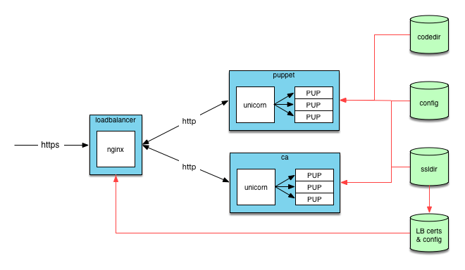

# What is this?

This repo lets you stand up a Puppet server stack in Docker.

This is unsupported, so caveat emptor and all that.

# Getting started

Build the containers:

    docker-compose build

If you'd like to stand up a master with the name of "puppet", then run:

    ./bootstrap-ssl puppet

This will create a `./data` directory, suitable for use with docker-compose. Now
you can spin things up:

    docker-compose up

That should map port 8140 to your docker host.

# Testing it out with a sample agent

Create a server stack with for a hostname of "loadbalancer". This is the name
the docker compose file assigns to the reverse-proxy and DNS is handled
automatically:

    ./bootstrap-ssl loadbalancer
    docker-compose up --build

Now spin up a fresh container that has our agent bits on it:

    docker-compose run ca /bin/bash

This will run the CA image, but instead of starting up a master it'll just
startup a shell. The CA also has our agent bits installed, so it'll work in a
pinch for testing purposes. In that container, run:

    puppet agent -t --server loadbalancer

This will terminate because the cert hasn't been signed for this new agent.
Because this "agent" container is really just the same container as the CA,
complete with read/write access to the SSL directory, we can just sign our cert
ourselves (cue evil music):

    puppet cert sign --all

You can now re-run the agent:

    puppet agent -t --server loadbalancer

...and all should be well. If you want to try actually doing something with
this agent, then on the docker host:

    mkdir -p data/code/environments/production/manifests
    echo 'node default { notify {"Hello":} }' > data/code/environments/production/manifests/site.pp

Now when you run the agent, you should actually see some results. :)

# Architecture

### Puppet

* Environment variables
  * `DISABLE_CA` - If set, then disables the CA function within the container
* Volume mounts
  * `/etc/puppetlabs/code` - the user's puppet code aka `codedir`
  * `/puppet-conf` - Can contain any of `puppet.conf`, `hiera.yaml`, `auth.conf`,
    `environment.conf`, `autosign.conf`,  `custom_trusted_oid_mapping.yaml.conf`.
    If present, then the file in this directory will be used in place of the stock
    version
* Ports and protocols
  * 8140, plaintext HTTP
* API
  * well, the entire Puppet HTTP API, I suppose, minus the CA

This container users `unicorn`, fronting N `puppet` worker processes via Rack. N
is determined automatically based on the number of cores visible to the
container.

### CA

* Volume mounts
  * `/puppet-conf` - Can contain any of `puppet.conf`, `hiera.yaml`, `auth.conf`,
    `environment.conf`, `autosign.conf`,  `custom_trusted_oid_mapping.yaml.conf`.
    If present, then the file in this directory will be used in place of the stock
    version
  * `/etc/puppetlabs/puppet/ssl` - standard puppet `ssldir`, complete with CA,
    cert, and key material needed for the deployment.
* Ports and protocols
  * 8140, plaintext HTTP
* API
  * the CA HTTP API only

This is the same exact container as the Puppet container, but it only handles
CA-related requests. Because it's the CA, it does need read/write access to the
SSL material for the deployment (the normal "compiler" container does not).

### Load balancer

* Environment variables
  * `UPSTREAMS` - host:port for a Puppet service, so we can proxy to it
  * `CA` - host:port for the CA service, so we can proxy to it
* Volume mounts
  * `/app` - contains your CA pubkey, CRL, server cert, and server key
* Ports and protocols
  * 8140, HTTPS
* API
  * the entire Puppet HTTP API

### Misc

The `bootstrap-ssl` script will help setup and populate the volumes these
containers need.

The `puppet` script lets you run any puppet subcommand (e.g. `puppet cert
--sign`) against the SSL files contained in the volumes. It spins up a
temporary container with our agent installed, mounts the SSL directory into
`/etc/puppetlabs/ssl`, runs the specified subcommand, then terminates. You can
use this script for care and feeding of the puppet deployment.

There is a docker-compose file in this repo that automatically maps the
required volumes and starts up the containers in the right order.

# TODO

There are a ton of ways you can help make this better, with very few things
requiring any hardcore programming knowledge. Here are some areas where we could
use help. Please send pull requests, including those that add to the list of
TODOs!

#### Hygiene

- [ ] Move images into their own repos (once they're sufficiently baked)
  - [ ] Add in metadata specifications for each

#### PuppetDB

- [ ] Add container for PDB
  - [ ] Port to Alpine linux, to minimize size
- [ ] Modify SSL bootstrap script to also generate cert for the PDB daemon
- [ ] Connect master containers to PDB
   - [ ] Modify master container to include PDB terminus
   - [ ] Modify master container to point at PDB daemon
   - [ ] Make this configurable (using multiple compose files) for those that don't need or want to run PDB
- [ ] Add container for postgres
   - [ ] Add relevant extensions (e.g. pg_trm)
- [ ] _investigate_ Can we use cert-based auth for postgres?

#### Master

- [X] Auto-configure number of worker processes
- [X] Enable override of default environment.conf
- [X] Enable override of default autosign.conf
- [X] Enable override of default custom_trusted_oid_mapping.yaml.conf
- [ ] _investigate_ Give masters only minimum SSL data required to run
- [ ] Port to Alpine linux, to minimize size

#### CA

- [X] Externalize CA into its own container
- [ ] Independent env var control of the number of CA workers
- [X] _investigate_ Does the loadbalancer need to proxy/rewrite CA requests?

#### Load balancer

- [X] Make hostname of upstream configurable (environment vars?)
- [X] Make number of worker processes configurable
- [ ] _investigate_ Offload static file serving from Masters
- [X] Try the nginx Alpine-based image
- [ ] _investigate_ Can we make upstreams dynamic? SRV records? Querying the container runtime?
- [ ] Automatically issue a nginx reload when the CRL is updated
